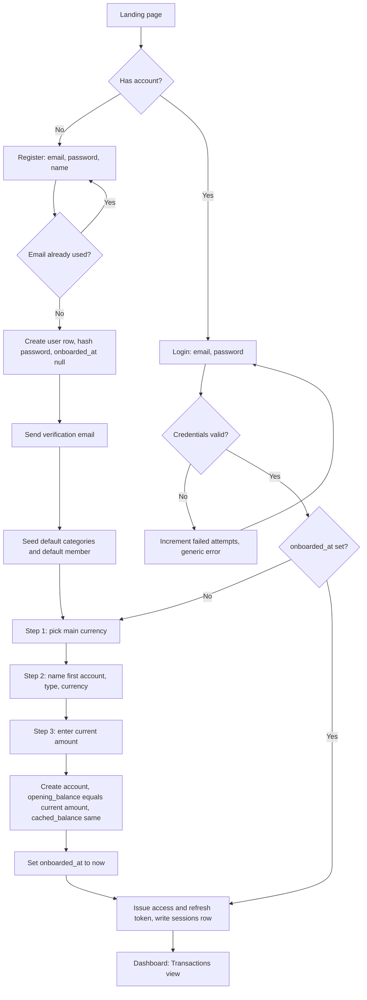
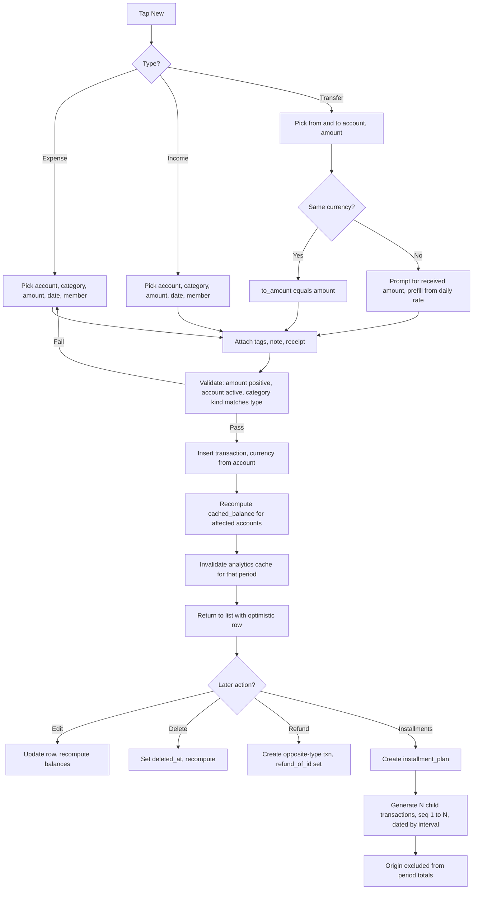
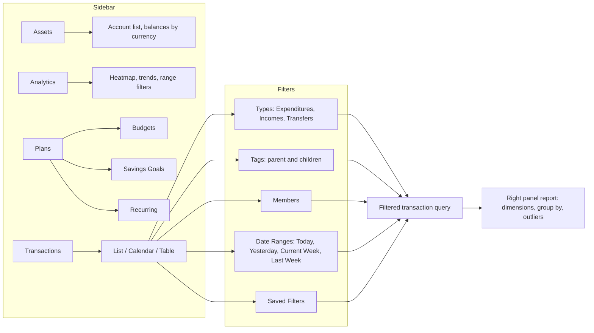
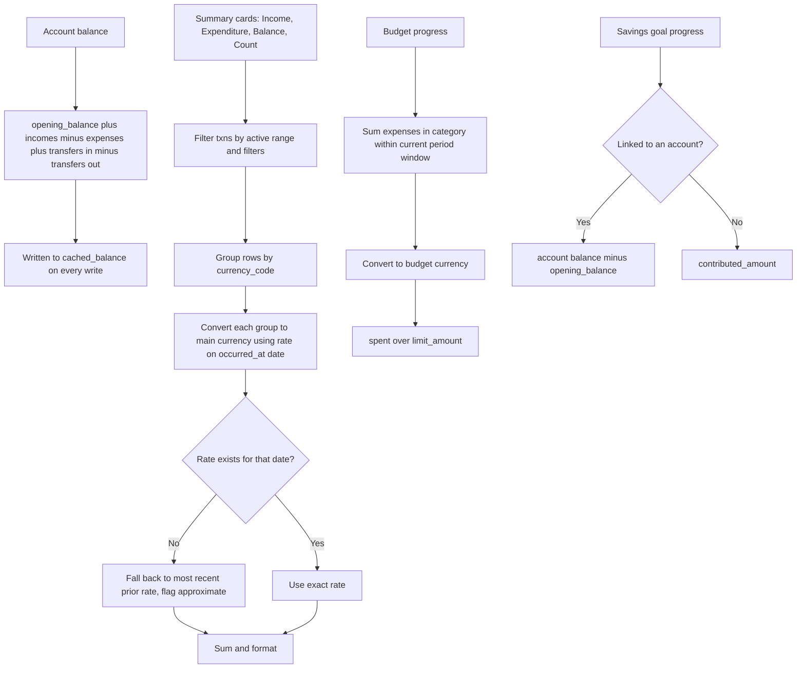
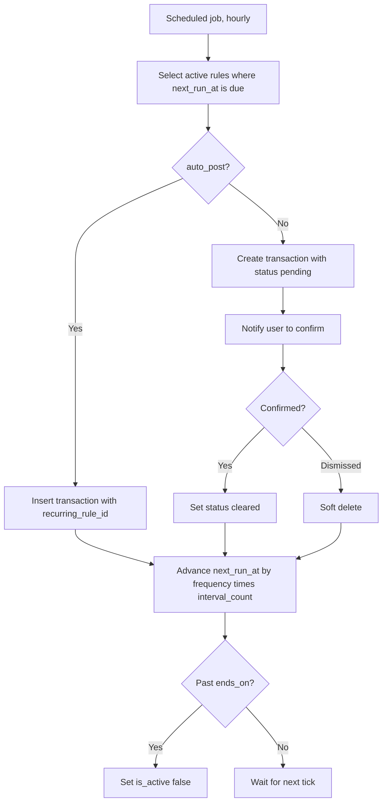

# Tally — Data Model & Application Flows

Spec for a multi-currency personal finance SaaS, derived from the `Tally_Finance_dc.html` prototype.
This document is the source of truth for schema and flows. Hand it to Claude Code as context.

---

## 1. Product decisions (locked)

| Decision | Choice |
| --- | --- |
| Tenancy | Single user per ledger. **Members are payer labels**, not real accounts — no invites, no sharing, no row-level ACL. |
| Plans | Umbrella nav item covering **three separate features**: Budgets, Savings Goals, Recurring Transactions. |
| Currency | Each account holds its own currency. Totals convert **live** against a daily `exchange_rates` table. No rate snapshot on the transaction row. |
| Auth | Email + password registration. Onboarding creates the first account and its starting balance before the user reaches the dashboard. |
| Sidebar | `Scenes` section is **removed** — it duplicated Transactions. See §7 for the final IA. |

---

## 2. Conventions

- **IDs** — UUID v7 primary keys everywhere.
- **Money** — stored as `bigint` in **minor units** (cents/fen/sen). Never floats. Decimal count comes from `currencies.decimal_digits` (JPY = 0, CNY/USD = 2).
- **Sign convention** — `transactions.amount` is always **positive**. Direction comes from `transactions.type`. Do not encode expense as a negative number.
- **Time** — all timestamps stored UTC. `occurred_at` is the user-facing transaction time; `created_at` is the record time. The user's `timezone` governs day-bucketing in analytics (a 23:30 JST purchase belongs to that JST day).
- **Tenancy** — every user-owned table carries `user_id`. Scope every query by it, no exceptions.
- **Deletes** — soft delete (`deleted_at`) on `transactions`, `accounts`, `categories`, `tags`. Hard delete only for join rows.
- **Balances** — derived from transactions, not authoritative columns. `accounts.cached_balance` exists purely as a read optimisation, recomputed on write (see §8).

---

## 3. Entity relationship diagram

```mermaid
erDiagram
    USERS ||--o{ SESSIONS : "authenticates via"
    USERS ||--o| SUBSCRIPTIONS : "has"
    USERS ||--o{ ACCOUNTS : owns
    USERS ||--o{ CATEGORIES : owns
    USERS ||--o{ TAGS : owns
    USERS ||--o{ MEMBERS : owns
    USERS ||--o{ TRANSACTIONS : owns
    USERS ||--o{ BUDGETS : owns
    USERS ||--o{ SAVINGS_GOALS : owns
    USERS ||--o{ RECURRING_RULES : owns
    USERS ||--o{ SAVED_FILTERS : owns

    CURRENCIES ||--o{ ACCOUNTS : denominates
    CURRENCIES ||--o{ USERS : "is main currency of"
    CURRENCIES ||--o{ EXCHANGE_RATES : base
    CURRENCIES ||--o{ EXCHANGE_RATES : quote

    ACCOUNTS ||--o{ TRANSACTIONS : "is source of"
    ACCOUNTS ||--o{ TRANSACTIONS : "is destination of"
    ACCOUNTS ||--o{ SAVINGS_GOALS : funds

    CATEGORIES ||--o{ CATEGORIES : "parent of"
    CATEGORIES ||--o{ TRANSACTIONS : classifies
    CATEGORIES ||--o{ BUDGETS : "is scoped to"

    TAGS ||--o{ TAGS : "parent of"
    TAGS ||--o{ TRANSACTION_TAGS : "applied via"
    TRANSACTIONS ||--o{ TRANSACTION_TAGS : "tagged via"

    MEMBERS ||--o{ TRANSACTIONS : "attributed to"

    TRANSACTIONS ||--o{ TRANSACTIONS : "refunded by"
    TRANSACTIONS ||--o{ ATTACHMENTS : has
    INSTALLMENT_PLANS ||--o{ TRANSACTIONS : generates
    TRANSACTIONS ||--o| INSTALLMENT_PLANS : originates
    RECURRING_RULES ||--o{ TRANSACTIONS : generates

    USERS {
        uuid id PK
        string email UK
        string password_hash
        string display_name
        string main_currency_code FK
        string timezone
        string color_convention "western or eastern"
        boolean show_cents
        string accent_color
        datetime email_verified_at
        datetime onboarded_at "null until first account exists"
        datetime created_at
        datetime deleted_at
    }

    SESSIONS {
        uuid id PK
        uuid user_id FK
        string refresh_token_hash UK
        string user_agent
        string ip_address
        datetime expires_at
        datetime revoked_at
        datetime created_at
    }

    SUBSCRIPTIONS {
        uuid id PK
        uuid user_id FK
        string tier "free or pro"
        string status "trialing active past_due canceled"
        string provider_customer_id
        string provider_subscription_id
        datetime current_period_end
        datetime created_at
    }

    CURRENCIES {
        string code PK "ISO 4217"
        string name
        string symbol
        int decimal_digits
        boolean is_active
    }

    EXCHANGE_RATES {
        uuid id PK
        string base_code FK
        string quote_code FK
        date rate_date
        decimal rate
        string source
        datetime created_at
    }

    ACCOUNTS {
        uuid id PK
        uuid user_id FK
        string name
        string type "cash bank credit_card e_wallet investment liability"
        string currency_code FK
        bigint opening_balance "minor units, set at creation"
        bigint cached_balance "derived, recomputed on write"
        bigint credit_limit "nullable, credit_card only"
        int statement_day "nullable, credit_card only"
        string icon
        string color
        int sort_order
        boolean exclude_from_net_worth
        boolean is_archived
        datetime created_at
        datetime deleted_at
    }

    CATEGORIES {
        uuid id PK
        uuid user_id FK
        uuid parent_id FK "nullable, one level deep"
        string name
        string emoji
        string kind "expense or income"
        int sort_order
        boolean is_system "seeded default"
        datetime deleted_at
    }

    TAGS {
        uuid id PK
        uuid user_id FK
        uuid parent_id FK "nullable, Cars is parent of Benz"
        string name
        string color
        datetime deleted_at
    }

    MEMBERS {
        uuid id PK
        uuid user_id FK
        string name
        string initials
        string color
        boolean is_default
        datetime deleted_at
    }

    TRANSACTIONS {
        uuid id PK
        uuid user_id FK
        string type "expense income transfer"
        uuid account_id FK "source account"
        uuid to_account_id FK "nullable, transfers only"
        uuid category_id FK "nullable for transfers"
        uuid member_id FK "nullable"
        bigint amount "positive, minor units, source currency"
        string currency_code FK "denormalised from account"
        bigint to_amount "nullable, cross-currency transfers"
        datetime occurred_at
        string note
        string status "cleared or pending"
        uuid refund_of_id FK "nullable, points at refunded txn"
        uuid installment_plan_id FK "nullable"
        int installment_seq "nullable, 1 of N"
        uuid recurring_rule_id FK "nullable, provenance"
        datetime created_at
        datetime updated_at
        datetime deleted_at
    }

    TRANSACTION_TAGS {
        uuid transaction_id FK
        uuid tag_id FK
    }

    ATTACHMENTS {
        uuid id PK
        uuid transaction_id FK
        string storage_key
        string mime_type
        int byte_size
        datetime created_at
    }

    INSTALLMENT_PLANS {
        uuid id PK
        uuid user_id FK
        uuid origin_transaction_id FK
        bigint total_amount
        int installment_count
        string interval_unit "month or week"
        bigint fee_amount
        date first_due_date
        string status "active completed canceled"
        datetime created_at
    }

    BUDGETS {
        uuid id PK
        uuid user_id FK
        uuid category_id FK "nullable, null means overall budget"
        string name
        bigint limit_amount
        string currency_code FK
        string period "weekly monthly quarterly yearly"
        date start_date
        boolean rollover_unused
        boolean is_active
        datetime created_at
    }

    SAVINGS_GOALS {
        uuid id PK
        uuid user_id FK
        uuid account_id FK "nullable, account tracking the goal"
        string name
        string emoji
        bigint target_amount
        bigint contributed_amount "manual, or derived from account"
        string currency_code FK
        date target_date
        string status "active achieved archived"
        datetime created_at
    }

    RECURRING_RULES {
        uuid id PK
        uuid user_id FK
        string name
        string txn_type "expense income transfer"
        uuid account_id FK
        uuid to_account_id FK "nullable"
        uuid category_id FK
        uuid member_id FK "nullable"
        bigint amount
        string currency_code FK
        string frequency "daily weekly monthly yearly"
        int interval_count "every N periods"
        int day_of_month "nullable"
        int day_of_week "nullable"
        date starts_on
        date ends_on "nullable"
        datetime next_run_at
        datetime last_run_at
        boolean auto_post "true posts silently, false asks to confirm"
        boolean is_active
    }

    SAVED_FILTERS {
        uuid id PK
        uuid user_id FK
        string name
        jsonb criteria "types categories tags members accounts range"
        int sort_order
        datetime created_at
    }
```



---

## 4. Enums

```
account.type          cash | bank | credit_card | e_wallet | investment | liability
category.kind         expense | income
transaction.type      expense | income | transfer
transaction.status    cleared | pending
budget.period         weekly | monthly | quarterly | yearly
recurring.frequency   daily | weekly | monthly | yearly
subscription.tier     free | pro
subscription.status   trialing | active | past_due | canceled
savings_goal.status   active | achieved | archived
installment.status    active | completed | canceled
```

---

## 5. Registration & onboarding

Signup is not complete until an account with a starting balance exists. `users.onboarded_at` gates entry to the app.



**Implementation notes**

- The starting balance is stored as `opening_balance`, *not* as a synthetic "initial balance" transaction. Keeps the ledger clean and makes balance math a single addition.
- Adding further accounts later reuses steps 2–3 as a modal — same handler.
- Default categories seeded from the prototype: Delivery 🍕, Pet 🐸, Gasoline ⛽, Fruit 🥝, Health 🧬, Travel ⛱️, plus Salary, Bonus, Refund on the income side.
- Password reset mirrors login: single-use token, short TTL.
- Login errors stay generic ("email or password is incorrect") so the form can't be used to enumerate registered emails.

---

## 6. Transaction lifecycle



**Refund semantics** — a refund is a real transaction of the opposite type, linked by `refund_of_id`. It appears in the ledger and moves the balance. Reports may net refunds against the original when calculation mode is set to net.

**Installment semantics** — the origin transaction records the purchase; the N children are what actually hit the account over time. To avoid double counting, exclude the origin row (`installment_plan_id IS NOT NULL AND installment_seq IS NULL`) from period sums.

---

## 7. Navigation & information architecture

`Scenes` removed. `Daily` was the same list as `Transactions`, so it collapses into one route with view modes.



Sidebar filters are **not** separate routes — they compose into the same query against `/transactions`. The counts beside each item come from one aggregate query, not one query per row.

---

## 8. Derived values



**FX rules**

- One row per `(base_code, quote_code, rate_date)`. Either store against a single base (e.g. USD) and cross-derive, or store pairs directly — pick one and stay consistent.
- Fetch daily via a scheduled job; backfill on miss.
- Never convert stored amounts. Conversion is read-time only, so switching main currency reprices the entire history instantly.
- Historical report totals will drift slightly as rates update. That is the accepted trade-off of live conversion.

---

## 9. Recurring rule execution



---

## 10. Indexes worth creating up front

```
transactions        (user_id, occurred_at DESC)
transactions        (user_id, type, occurred_at DESC)
transactions        (account_id, occurred_at)
transactions        (user_id, category_id, occurred_at)
transaction_tags    (tag_id, transaction_id)
exchange_rates      UNIQUE (base_code, quote_code, rate_date)
accounts            (user_id, is_archived)
sessions            (refresh_token_hash)
users               UNIQUE (email)
```

Add a partial index on `deleted_at IS NULL` for transactions if the database supports it — the list view always filters on it.

---

## 11. Deliberately deferred

- Shared ledgers and real member invites. The schema is single-tenant by choice, but `members` can later gain a nullable `user_id` to promote a label into a real collaborator without restructuring.
- Bank connections (Plaid or similar) and CSV import.
- Receipt OCR.
- Custom report builder beyond the existing dimension and group-by controls.
